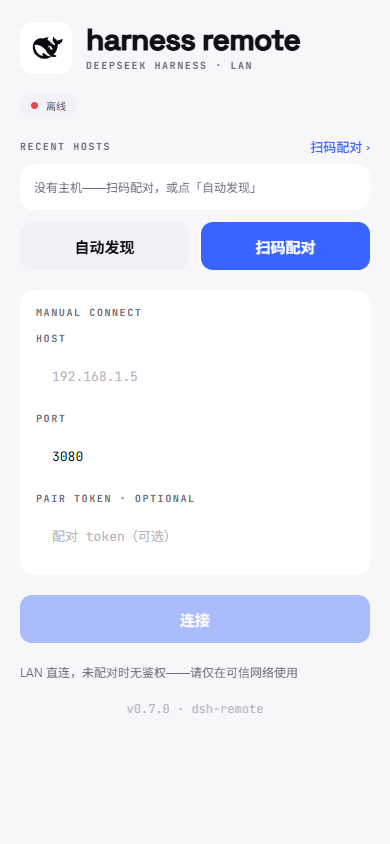
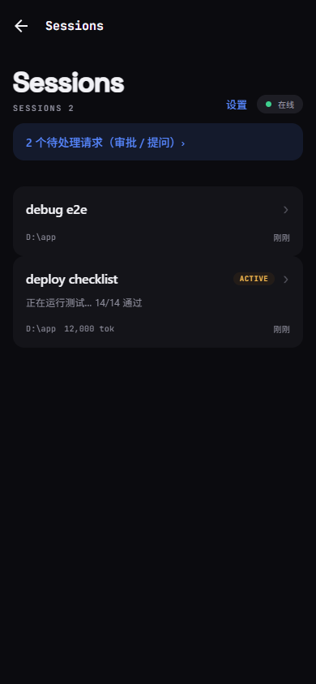
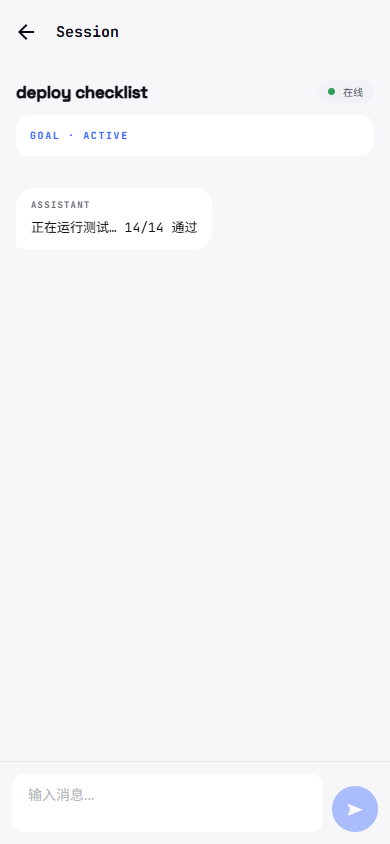
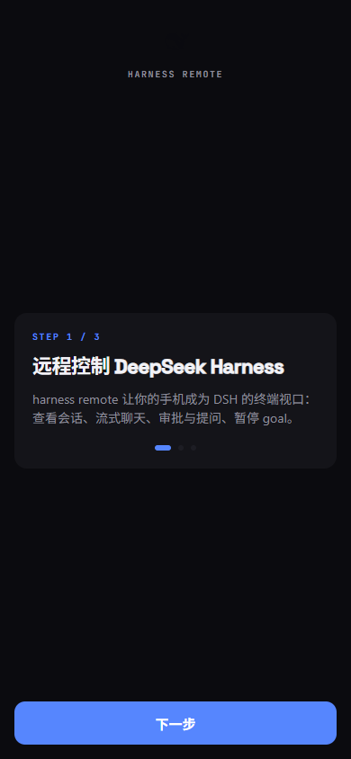

# dsh-remote — 手机远程连接 DeepSeek Harness

[](https://github.com/Andiii208/dsh-remote/actions/workflows/ci.yml)
[](https://github.com/Andiii208/dsh-remote/releases)
[](LICENSE)
[](docs/COMPATIBILITY.md)

dsh-remote 是一个开源社区产品：用手机远程连接 DeepSeek Harness（DSH），离开电脑后也能盯住 agent、接收通知、一键审批、回答提问、继续对话。对标 Claude Code Remote Control 的定位，但面向 DSH 开源生态，代码与数据都留在用户本机，手机只是视口。

- **跨端**：React Native + Expo（TypeScript），iOS + Android 一套代码，EAS 云构建无需 Mac 即可出 iOS 包。
- **LAN 起步、传输可插拔**：自动发现 + 二维码配对 + 最近主机一键重连，也可以手动直连局域网内的 DSH（`host:3080`）；传输层抽象为 `Transport` 接口，中继/公网为预留演进方向，不平滑推翻重来。
- **低门槛连接（P2）**：首启 3 步引导 → 扫码电脑上的配对二维码即连（`dshremote://pair` 深链）；同一局域网点「自动发现」列出可用实例；冷启动自动重连最近主机。
- **协议对齐**：纯 TS 协议包（`packages/protocol`，零 RN 依赖）与 DSH 原生类型零失真对齐；宽容解码，线上层永不因未知数据崩溃。
- **设计**：UI 设计系统 v7（docs/design/UI-SYSTEM-v7.md）——双主题（浅/深跟随系统）、DeepSeek 官方主按钮蓝（浅 `#3964FE` / 深 `#5686FE`）、官方黑色鲸鱼、Space Grotesk 显示字体；动效克制且尊重系统「减弱动态」。

## 界面预览

| 连接页 | 会话列表 | 聊天 | 首启引导 |
|---|---|---|---|
|  |  |  |  |

> 截图来自 Web 预览（390×844 视口，浅/深双主题各截其一：连接页浅色、会话列表深色、聊天浅色、首启引导深色）；真机观感一致（通知/扫码为原生能力，Web 会优雅降级）。

## 仓库结构

```
dsh-remote/
├── apps/
│   └── mobile/            # Expo RN App（iOS + Android）
│       ├── app/           # expo-router 页面：连接、会话列表、聊天、审批
│       ├── src/
│       │   ├── transport/ # ConnectionProvider + pipeline（装配 ConnectionLoop）
│       │   ├── data/      # SessionStore：会话镜像、折叠、投影派生
│       │   ├── notify/    # 通知分类器 → 本地通知（expo-notifications）+ 后台保活
│       │   ├── discovery/ # 最近主机 / 子网自动发现 / 配对深链 / 首启引导
│       │   ├── ui/        # 设计系统 v7 组件（WhaleMark/StatusChip/Button/Field/…）
│       │   ├── theme.ts   # DSH 设计令牌 v7（双主题：浅 #3964FE / 深 #5686FE）
│       │   └── theme-context.tsx # ThemeProvider + useTheme（跟随系统深浅色）
│       └── app.json       # EAS 配置（云构建）
├── packages/
│   └── protocol/          # TS 协议核心（纯 TS，零运行时依赖）
│       └── src/           # envelopes / codec / rpc / ws / transport / loop / dto
├── mock-harness/          # DSH /api + WS 测试桩（回放 conformance fixtures）
├── tools/
│   └── capture/           # 录制真实 DSH 流量 → conformance fixtures
├── harness-plugin/        # DSH 宿主配对插件（M2：token 签发/校验/配对围栏）
├── relay/                 # （预留）中继服务器
├── docs/
│   ├── ARCHITECTURE.md / PROTOCOL.md / COMPATIBILITY.md / SECURITY.md
│   └── design/            # UI-SYSTEM.md / BRAND.md / CONNECTION-UX.md
└── package.json / pnpm-workspace.yaml / tsconfig 等
```

## 快速开始

```bash
pnpm install
pnpm test
pnpm typecheck
pnpm audit --prod   # 发布前依赖审计

# 起 mock-harness（无需真实 DSH 即可联调；手机同 Wi-Fi 联调时加 --host 0.0.0.0）
pnpm --filter mock-harness build
node mock-harness/dist/cli.js --port 3080

# 录制真实 DSH 流量 → conformance fixtures（需要可达的 DSH）
pnpm --filter @dsh-remote/capture build
node tools/capture/dist/cli.js record --host 127.0.0.1 --port 3080 --out ./fixtures
```

## 构建（EAS 云构建，无需 Mac 出 iOS 包）

```bash
cd apps/mobile
npx eas-cli build --profile development   # 开发版（development client）
npx eas-cli build --profile preview       # 内部预览
npx eas-cli build --profile production    # 商店版（自动递增 build number）
```

前置：`eas.json` 已配置三个 profile；首次运行 `npx eas-cli login` + `npx eas-cli init`（写入 `extra.eas.projectId`）。真机联调步骤见 [docs/MANUAL.md](docs/MANUAL.md)。

## 文档

- 设计文档（v0，已确认）：[docs/superpowers/specs/2026-08-16-dsh-remote-mobile-design.md](docs/superpowers/specs/2026-08-16-dsh-remote-mobile-design.md)
- [docs/ARCHITECTURE.md](docs/ARCHITECTURE.md) — 架构与数据流
- [docs/PROTOCOL.md](docs/PROTOCOL.md) — 协议参考（信封/端点/WS/连接生命周期）
- [docs/COMPATIBILITY.md](docs/COMPATIBILITY.md) — 协议版本矩阵与 fixtures 回归流程
- [docs/SECURITY.md](docs/SECURITY.md) — 安全模型（MVP LAN → M2 配对 → M3 中继）
- [docs/MANUAL.md](docs/MANUAL.md) — 真机联调清单（M0/M1 手动验收）
- [docs/design/UI-SYSTEM-v7.md](docs/design/UI-SYSTEM-v7.md) — App UI 设计系统 v7（双主题 · DeepSeek 品牌 · 官方黑色鲸鱼）
- [docs/design/BRAND.md](docs/design/BRAND.md) — 品牌与 App 图标（DeepSeek 官方黑色鲸鱼）

## 里程碑状态

| 里程碑 | 状态 |
|---|---|
| M0 骨架与协议（monorepo + protocol + mock-harness + capture + docs + App 壳） | ✅ 已交付 |
| M1 遥控闭环（通知/保活/审批提问/消息/goal-todo 控制） | ✅ 已交付 |
| M2 跨端与安全（iOS EAS、配对 token 鉴权、开源发布） | ✅ 已交付 |
| M3 中继（预留） | 预留 |

> 状态：M0–M2 已通过评审（全仓 typecheck/test 绿）；Phase B 真机联调已在 Android 真机（Expo Go）验证通过（连接/会话/流式聊天/发消息/审批/提问/goal 暂停/断线重连），通知与后台保活需 development build 验证（Expo Go SDK 53+ 限制，见 [docs/MANUAL.md](docs/MANUAL.md)）。

## 贡献

- 开发流程与协议改动规范见 [CONTRIBUTING.md](CONTRIBUTING.md)。
- 行为准则见 [CODE_OF_CONDUCT.md](CODE_OF_CONDUCT.md)。
- 安全问题请走 [SECURITY.md](docs/SECURITY.md) 的私密披露渠道。

## 致谢

协议研究与 mock 方法论参考 [sorsama/deepseek-harness-mobile](https://github.com/sorsama/deepseek-harness-mobile)，保持协议兼容。
